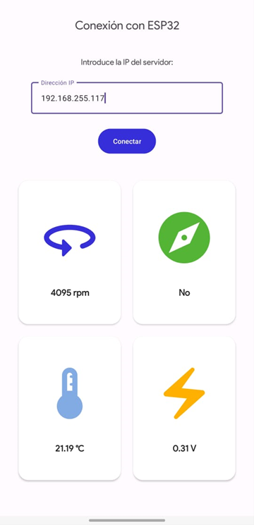

# Sensor Data Retrieval App for Android

Android application developed in Kotlin that allows retrieving values from various sensors and sending them over WiFi using an ESP32 device. The app provides an interface to retrieve sensor data through a GET method on the server IP address provided by the ESP32.

  

## Features

**Friendly User Interface:** The application has an intuitive user interface that allows users to select and retrieve data from various sensors.

**Real-Time Data Retrieval:** Sensor values are updated in real-time on the user interface, allowing users to view data in real time.

**Wireless Communication:** The application uses WiFi to send sensor data through an ESP32 device. Wireless communication ensures a cable-free connection for data transfer.

**Compatibility with Different Sensors:** The application supports a variety of sensors. The application measures revolutions per minute, voltage varied with a potentiometer, the presence of magnetic field and temperature in °C.

**Integration with ESP32:** Data retrieved by the app is sent over WiFi using an ESP32, which acts as a server to receive and process the data.
